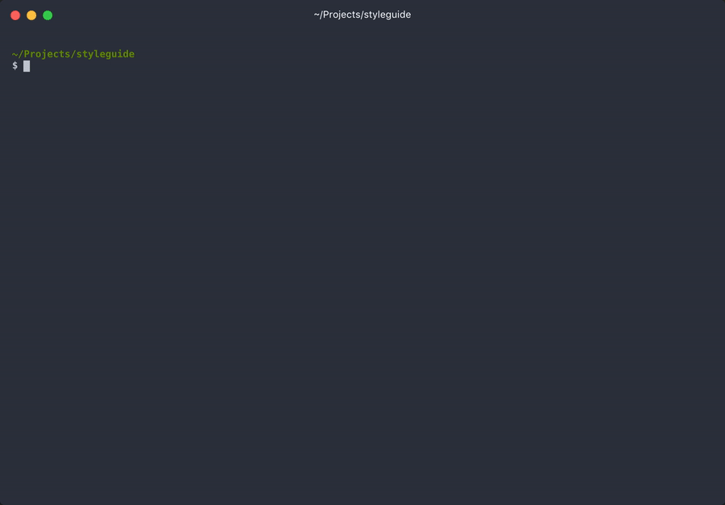

This is a Yeoman generator to create fractal components boilerplate.

## Installation

Install [Yeoman](http://yeoman.io) and generator-fractal-comp using [npm](https://www.npmjs.com/).

```bash
npm install -g yo
```
Either install the generator globally or as a dev dependency

```bash
npm install --save-dev generator-fractal-comp
```

## Configuration for Fractal
Create a `.yo-rc.json` file in the root of your project and set all the values according to your needs

```json
"generator-fractal-component": {
    "componentsDest": "./styleguide/components",
    "componentsTemplates": [
      {
        "name": "twig",
        "path": "./styleguide/templates/_component.twig",
        "checked": true
      },
      {
        "name": "scss",
        "path": "./styleguide/templates/_component.scss",
        "checked": true
      },
      {
        "name": "config",
        "path": "./styleguide/templates/_component.config.js",
        "checked": true
      },
      {
        "name": "js",
        "path": "./styleguide/templates/_component.js",
      },
      {
        "name": "readme",
        "path": "./styleguide/templates/_README.md",
      }
    ],
    "prefixComponents": false,
    "hookAfterChange": [
      {
        "cmd": "yarn",
        "args": [
          "fractal",
          "generate:sass"
        ]
      },
      {
        "cmd": "node",
        "args": [
          "./cli/updateJsIndex.js",
          "<%= typePath %>",
          "<%= name %>"
        ]
      }
    ],
    "componentTypes": [
      {
        "name": "atom",
        "path": "atoms",
        "prefix": "a"
      },
      {
        "name": "molecule",
        "path": "molecules",
        "prefix": "m"
      },
      {
        "name": "organism",
        "path": "organisms",
        "prefix": "o"
      },
      {
        "name": "template",
        "path": "templates",
        "prefix": "t"
      }
    ]
  }
```
## Run the generator

```bash
yo fractal-comp
```

## Preview


## ROADMAP
- [x] make the generator configurable
- [ ] add an example of project setup (with templates)
- [ ] document better (which variables are available in templates, etc)

<br>

Enjoy 🤘
